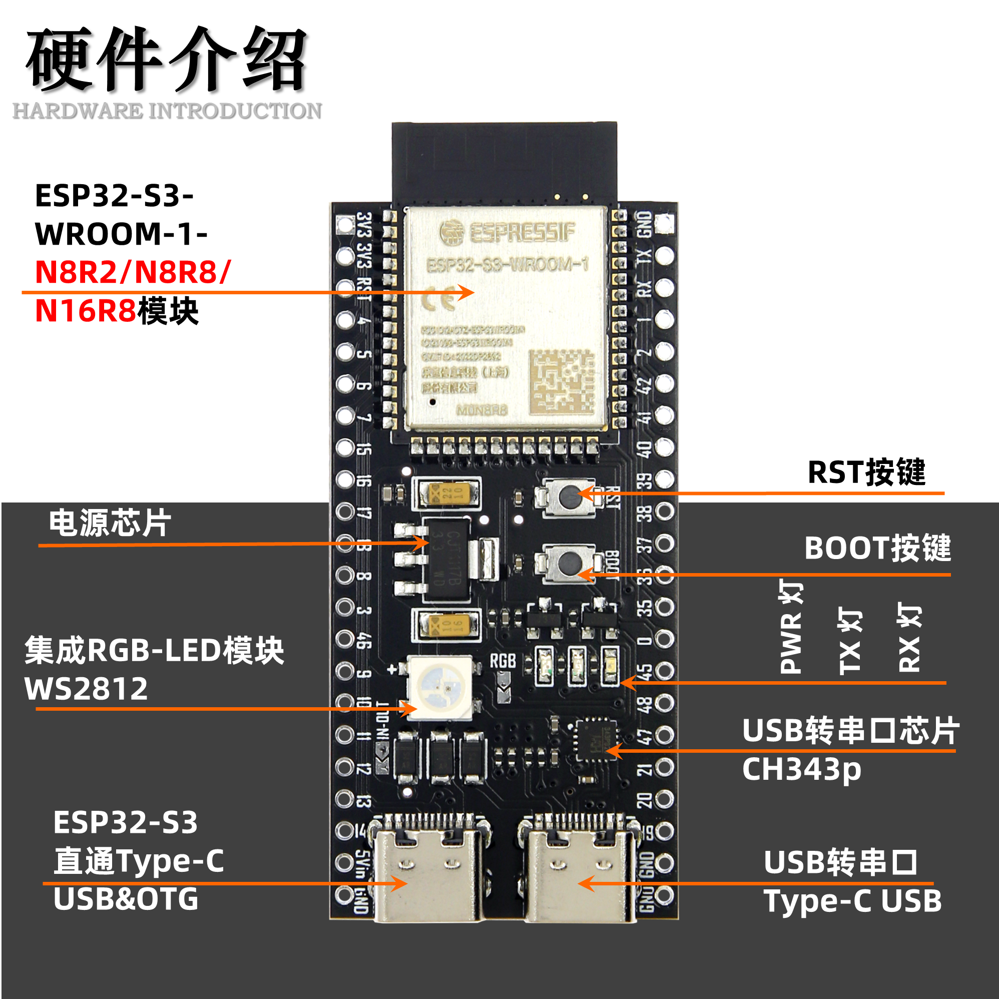
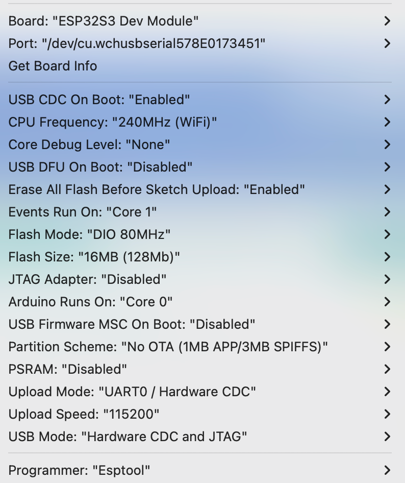

# esp32ai

ESP32-S3-DevKitC-1 




## 说明
1. esp32-s3-DevkitC-1 有2个type-c口， Mac M1 当使用 arduino 进行写入操作时，需要连接右边的 usb转串口type-c 接口。当进行 Serial Monitor 时，需要连接左边的直通 type-c 接口。

2. Mac M1 芯片需要安装 CH9102H 的相关驱动，并且板子本身已经装有 CH34XSER 芯片。驱动地址： [CH34XSER_MAC_ZIP](https://www.wch.cn/downloads/CH34XSER_MAC_ZIP.html)

3. 当驱动安装完成之后，会出现一个类型名称为 ```/dev/cu.wchusbserial578E0173451``` 的 Port, 选择这个 Port 才能正确写入。

4. arduino 需要引入 espressif 的 esp32 包，引入地址为 ```https://dl.espressif.com/dl/package_esp32_index.json```, 请将地址添加到 <br >
    Preference -> Settings -> Additonal boards manager URLs <br >
    多个地址以 ```,``` 分割

5. 在 esp32 包引入之后，请选择：<br >
    Tool -> Board -> esp32 -> ESP32S3 DEV Module

6. 当进行烧录时，还需要选择正确的 flash 配置，当前可用的配置如下：<br >
    

7. 当烧录完成后，需要将 usb 转为连接 左边的直通 type-c 接口，打开 Serial Monitor， 此时可用看到 setup 和 loop 的执行结果。

